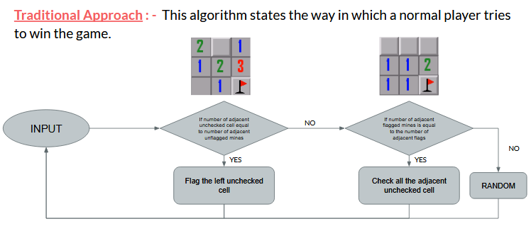
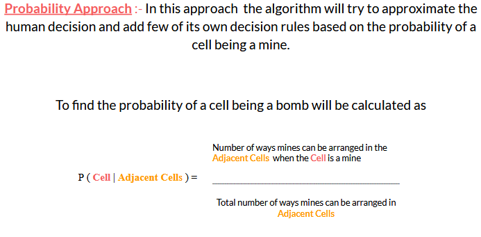
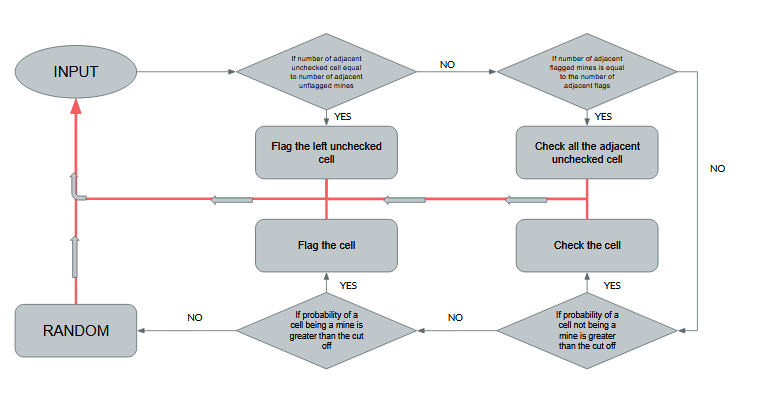
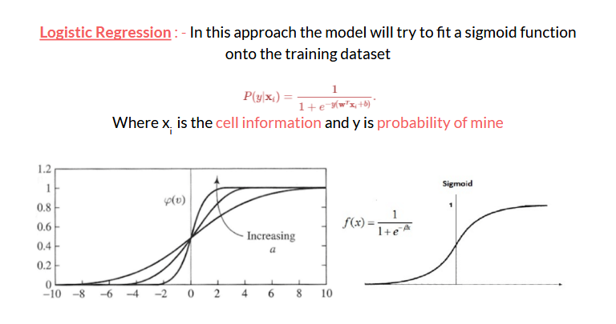
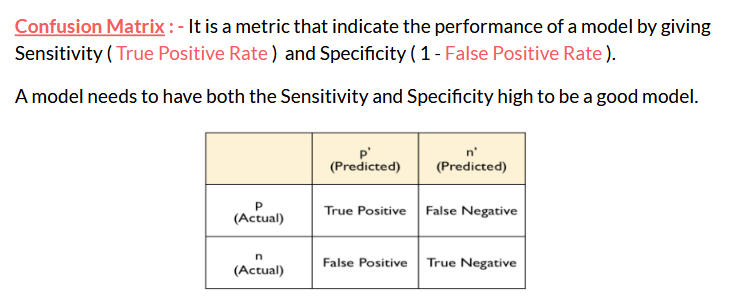
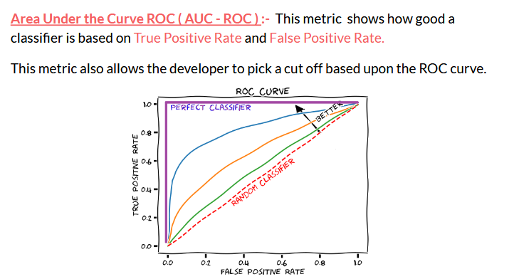
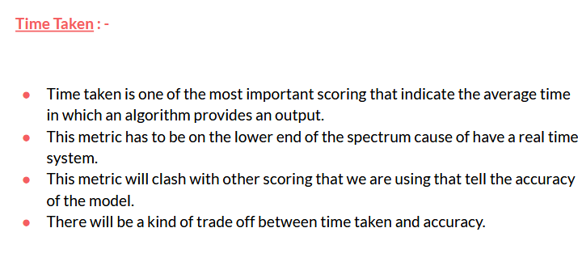

<h1>Introduction</h1>

- This project, we are going to build a Minesweeper game on top of Django framework.  
- Build a Bot that will able to solve the board by choosing best move in short amount of time.
- Each board will be scored on the basis of a timer ( i.e. time in which one completes the board ) that will evaluate the performance of either a bot or a User

<h1>Bot</h1>

<h2>Approaches</h2>

- **Traditional approch** is how a normal user plays Minesweeper game

- **Probabilistic approach** is probabilistic way of solving the game

- **Statistical approach** using Logistic Regression to solve the problem 

<h2>Scoring</h2>

- **Confusion matrix** will be used as a metric which will further be used to calculate Recall and Precision 

- **Area under the ROC curve** will inform us about how better the classifier is from Random classifier and also provide us with the best probability cut off

- **Time**

